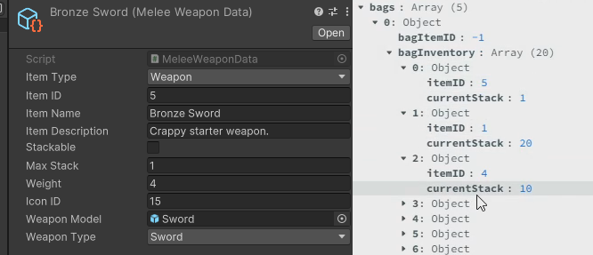
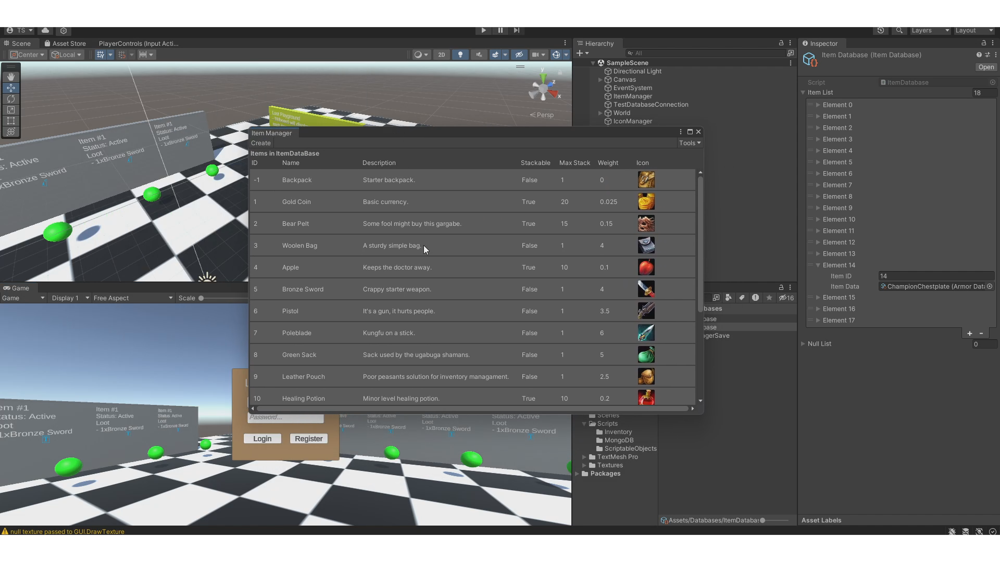
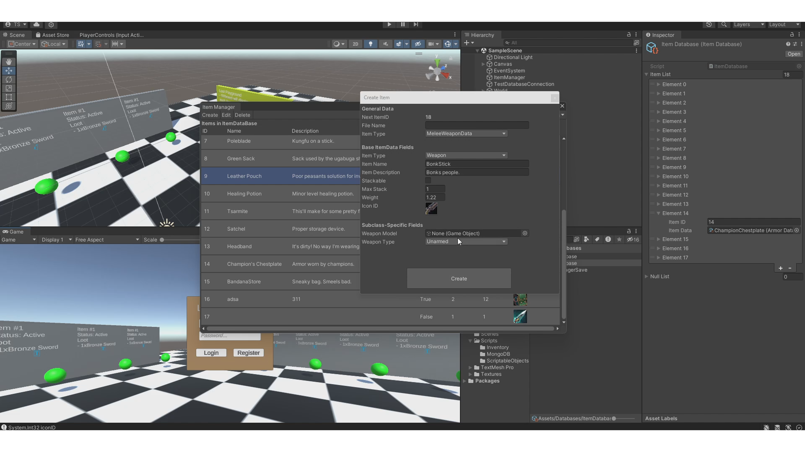
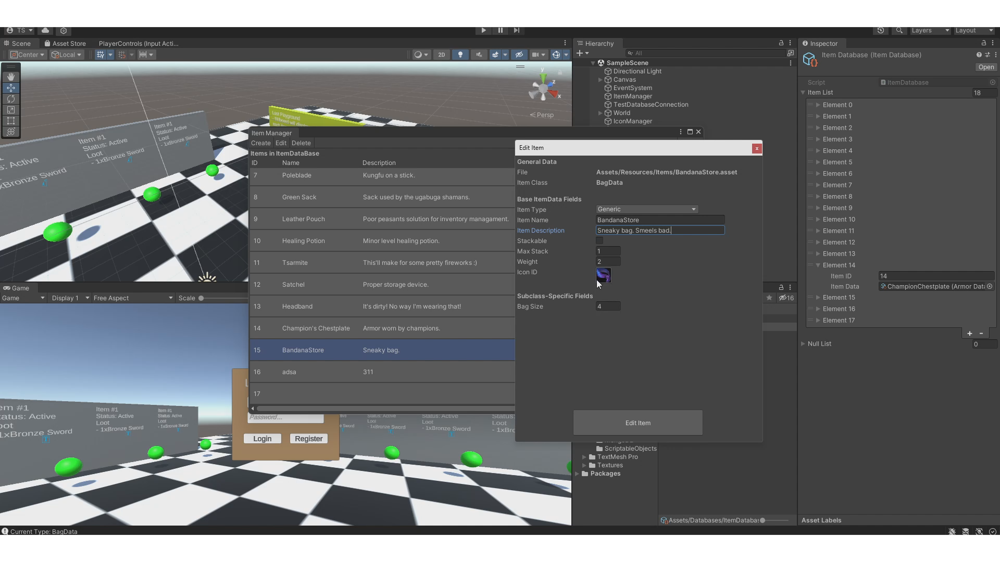
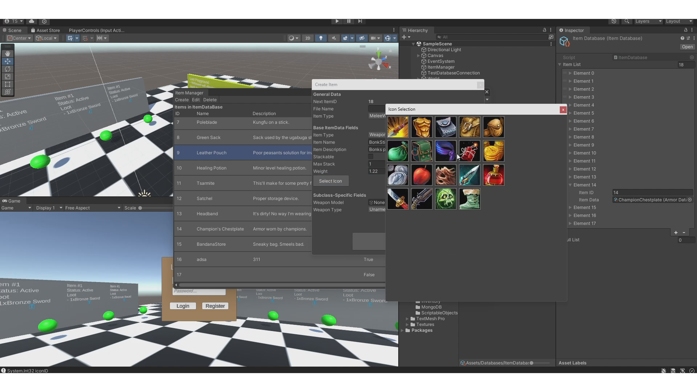
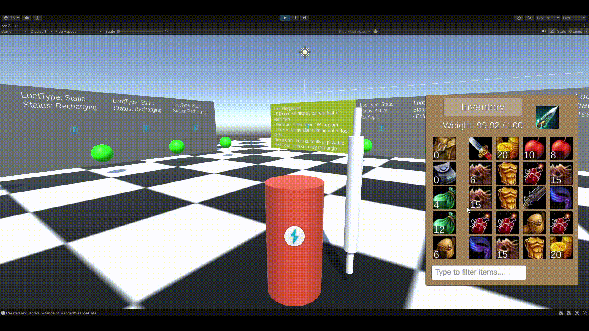
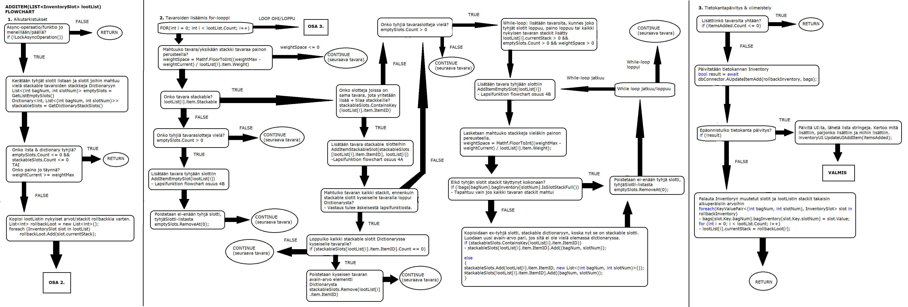

# NoSQL_Inventory
Unity inventory system where inventory data is stored and updated in MongoDB NoSQL database. All inventory updates are first made to the database before applying them in-game locally. Features item database and editor tools to add/remove/modify in-game items. 


## 🕹️ Features
- In-game Item & Icon databases (Assets/Databases/)
- Multiple item types (eg. Weapon, Consumable, Bag) and slot types (WeaponSlot, InventorySlot, BagSlot)
- Double clicking, right clicking and dragging inventory slots (by default Unity buttons only support left clicking)
- Search bar to search items in all bags
- Item Editor to create/edit/delete items and automatically update item database
- Inventory supports stackable items and weight count, which are used when adding/unequipping items
- Inventory synced with MongoDB collection (only updates inventory locally if mongoDB inventory item updates successfully)

While in-game items can variety of different fields/variables depending on item type / subclass; mongoDB will only store miminal necessary data to keep track of inventory's state / contents.
The game converts item data on fly to it's mongoDB format (mongoItemData, mongoWeaponData etc.) to efficiently & easily store the inventory data.
<br/>
Figure: On Left: Weapon's itemdata entry in Unity. On Right: inventory data stored in MongoDB in lightweight format.

## 🧩 Building your own MongoDB database for this project
1. Create new database to your cluster called 'noSQL_Inventory'
2. Create 2 new collections to your new database called 'inventories' and 'players'
- inventories will store player inventories, while players will store player data that contains reference to their respective inventory
3. In Assets/Scripts/MongoDB/TestDatabaseConnector.cs -> add your cluster's connection string to row 23
````
22  // Connection string to the MongoDB Atlas
23  string connectionString = "your-connection-string-to-your-mongoDB-cluster";
````
4. Uncomment row 39 in TestDatabaseConnector.cs to create UserName for players collection to enable username indexing (You only need to run this line once and then recomment the line)
````
37  // Add indexation to playerCollection "username" fields.
38  // This needs to be only run once and the indexation stays in the collection for all documents
39  //CreateUsernameIndex();
````
5. The database should now be usable ingame -> start the game -> register a player -> start collecting items and database should store the inventory data
<br/>PS. You don't necessarily have to name the collections and database same way as mine. Just rename the database & collection names in rows 29, 32 and 35.
````
28  // Connect to the database
29  database = client.GetDatabase("noSQL_Inventory");

31  // Access players collection
32  playerCollection = database.GetCollection<MongoPlayer>("players");

34  // Access inventories collection
35  inventoryCollection = database.GetCollection<MongoInventory>("inventories");
````

## 🧱 Unity Editor - Item Editor
Item Editor created to be used in the project in Unity Editor allows adding new items, editing data of already existing items and deleting items from the game. While you can edit item's data, you can't change it's subclass eg. change weapon to consumable, you must create new item instead.<br/>
Whenever item is created or deleted; it's automatically added to / removed from the item database and itemID will be assigned for it. If item that is not the newest item is deleted, the dropped itemID will be stored in Assets/Databases/ItemManagerSave file's DroppedID list, it also keeps track of next itemID if there are no dropped itemIDs.<br/>
Item variable fields are automatically generated using LINQ and it also features icon selection window that shows all icons in the iconDatabase.

<br/>
Figure: Item Editor Window.

<br/>
Figure: Item Editor - CreateItem Window.

<br/>
Figure: Item Editor - EditItem Window.

<br/>
Figure: Item Editor - IconSelectionWindow.

## 🕹️ Inventory UI features

Figure: InventoryUI feature: Double clicking - Uses consumable instantly.


Figure: InventoryUI feature: Dragging InventorySlots.


Figure: InventoryUI feature: Dragging stack to combine with another stack.


Figure: InventoryUI feature: Dragging item to another bag.


Figure: InventoryUI feature: Right Click Context Menu.


Figure: InventoryUI feature: Search Bar to search items from entire inventory.

## 🧱 Bonus
When adding items to inventory the game takes into calculation: weight, empty slots and stackable items stacks.
This hasn't been translated yet, but here's the flowchart of AddItem function of Assets/Scripts/Inventory/Inventory.cs in finnish.

